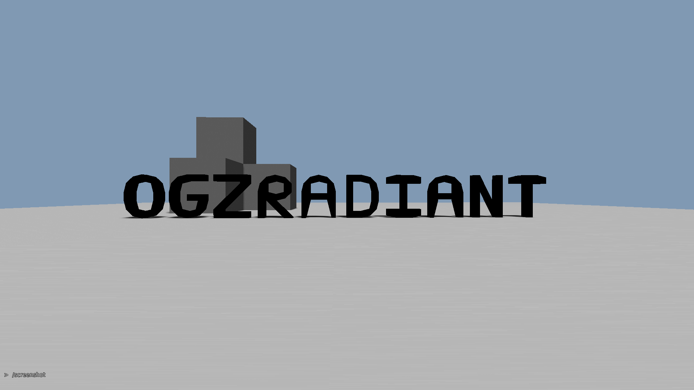

# OGZ Radiant
Cube 2 standalone OGZ map editor used for fast map prototyping.
- Originated from: https://sourceforge.net/p/sauerbraten/code/HEAD/tree/
[r6852]

## TODO:
- ~~Compile~~;
- ~~Build minimal packages/shaders/configs in order to run engine~~;
- Strip source code (remove gamemode/fps code);
- Implement export to q3map format;
  ...

## Notes
- Project has only started. Accepting active contributions.

## How to build
- Read "src/readme_source.txt" and install required dependencies
- Use makefile in main directory.

